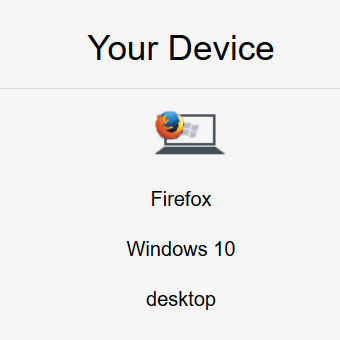
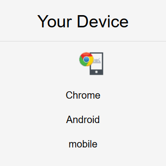
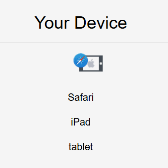
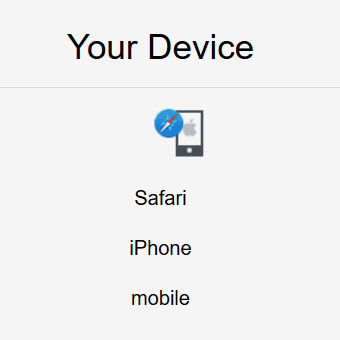
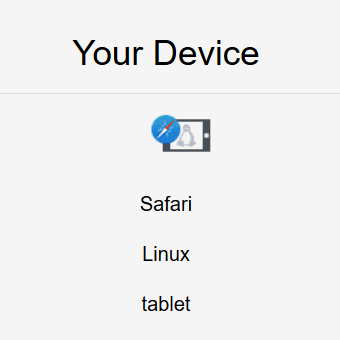

# Device Detection SPA

### About

This is a dockerized Vuejs and Lumen SPA

### Project setup
```
cd backend composer install
docker-compose build
```
### Project run
```
docker-compose up
visit http://localhost:8081/
```
### Project stop
```
docker-compose stop
```
### Example output
     
